# AI Workforce Risk & Burnout Analytics System

## Overview

AI Workforce Risk & Burnout Analytics System is a full-stack workforce intelligence platform designed to help organizations monitor employee productivity, identify burnout risks, detect workflow bottlenecks, and analyze workforce trends through interactive dashboards.

The system provides role-based access for Admins, Managers, and Employees, enabling secure access to workforce analytics, employee management, and burnout prediction features.

The platform combines FastAPI, PostgreSQL, Next.js, and AI-powered risk analysis to deliver actionable workforce insights.

---

## Key Features

### Authentication & Authorization

* Secure login system
* Role-based access control (RBAC)
* Admin, Manager, and Employee roles
* Protected frontend pages
* Role-based sidebar navigation
* JWT-based authentication

### Employee Management

* Add Employee
* Edit Employee
* Delete Employee
* Employee Search
* Department Filtering
* Burnout Risk Filtering
* Workforce Record Management

### Workforce Analytics

* Productivity Score Analytics
* Burnout Risk Monitoring
* Project Risk Analysis
* Workload Status Tracking
* Workflow Bottleneck Detection
* Risk Trend Analysis
* Anomaly Detection

### Employee History Tracking

* Historical Risk Scores
* Productivity Score History
* Burnout Risk History
* Monthly Employee Risk Tracking
* Dynamic Employee Selection
* Historical Analytics Visualization

### Burnout Prediction Engine

The system predicts employee burnout risk based on:

* Hours Worked
* Tasks Completed
* Delay Days

Risk Categories:

* Low
* Medium
* High

### Interactive Dashboards

#### Admin Dashboard

* KPI Cards
* Productivity Trends
* Burnout Analytics
* Project Delay Analytics
* Workload Status
* Bottleneck Detection
* Employee Risk History
* Risk Trend Analysis
* Anomaly Frequency
* Workforce Distribution Analytics

#### Manager Dashboard

* KPI Cards
* Productivity Trends
* Project Delay Analytics
* Workforce Analytics
* Employee Risk History
* Bottleneck Detection

#### Employee Dashboard

* Personal Analytics
* Burnout Trends
* Workload Distribution
* Risk Trend Visualization
* Burnout Prediction Access

---

## Tech Stack

### Frontend

* Next.js
* React
* TypeScript
* Tailwind CSS
* Axios
* Recharts

### Backend

* FastAPI
* Python

### Database

* PostgreSQL
* SQLAlchemy ORM

### Authentication

* JWT (JSON Web Tokens)

### Deployment

* Frontend: Vercel
* Backend: Render
* Database: Render PostgreSQL

---

## System Architecture

```text
User Browser
      │
      ▼
Next.js Frontend (Vercel)
      │
      ▼
FastAPI Backend (Render)
      │
      ▼
PostgreSQL Database (Render)
```

### Workflow

1. User logs into the platform.
2. JWT token is generated and stored.
3. Role-based permissions are applied.
4. Frontend requests analytics data from FastAPI.
5. Backend retrieves employee records from PostgreSQL.
6. Risk scoring and burnout analysis are calculated.
7. Results are displayed through interactive charts and dashboards.

---

## Analytics Modules

### Productivity Analytics

Measures workforce productivity using:

* Tasks Completed
* Delay Days

### Risk Scoring Engine

Calculates employee risk scores based on:

* Productivity
* Overtime
* Delays

### Burnout Prediction

Predicts burnout probability using:

* Working Hours
* Task Completion
* Project Delays

### Bottleneck Detection

Identifies workflow inefficiencies and delayed processes.

### Trend Analysis

Tracks workforce performance and risk trends over time.

### Anomaly Detection

Detects unusual workforce behavior and operational risks.

---

## Screenshots

### Login Page

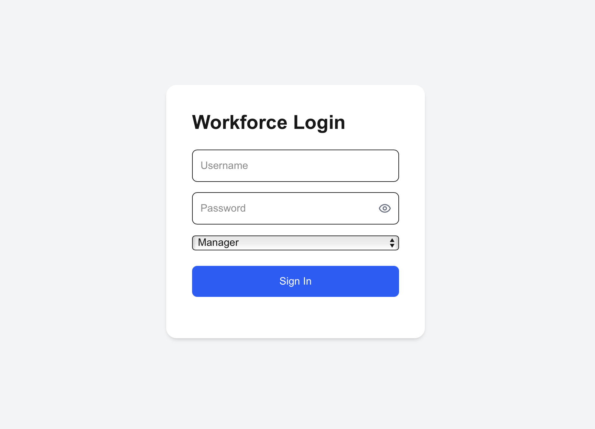

---

### Admin Dashboard

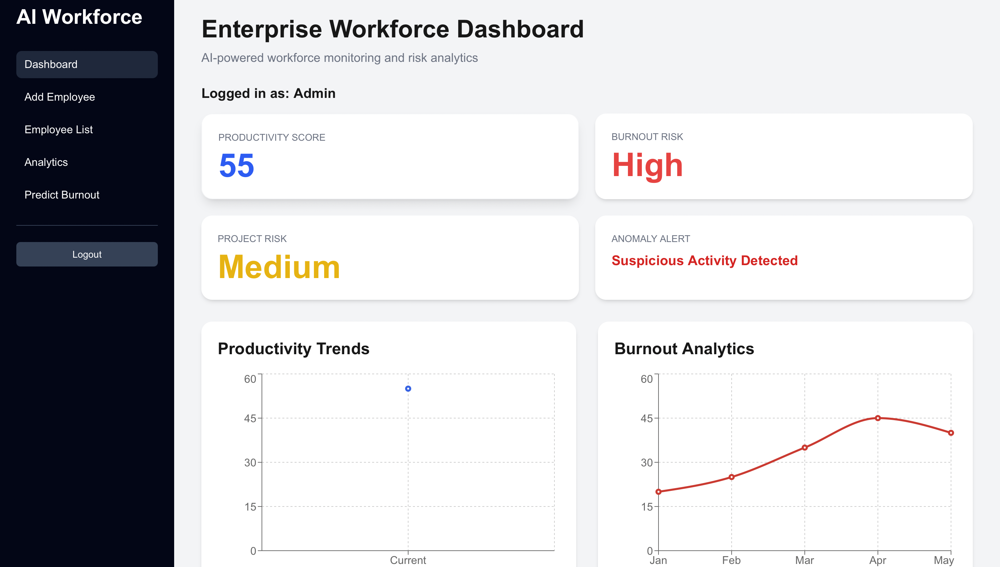

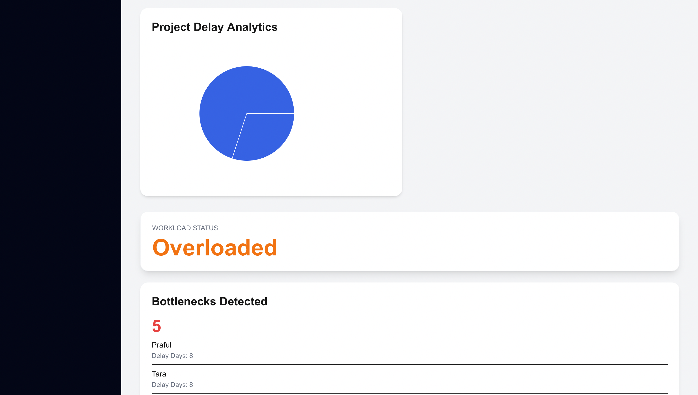

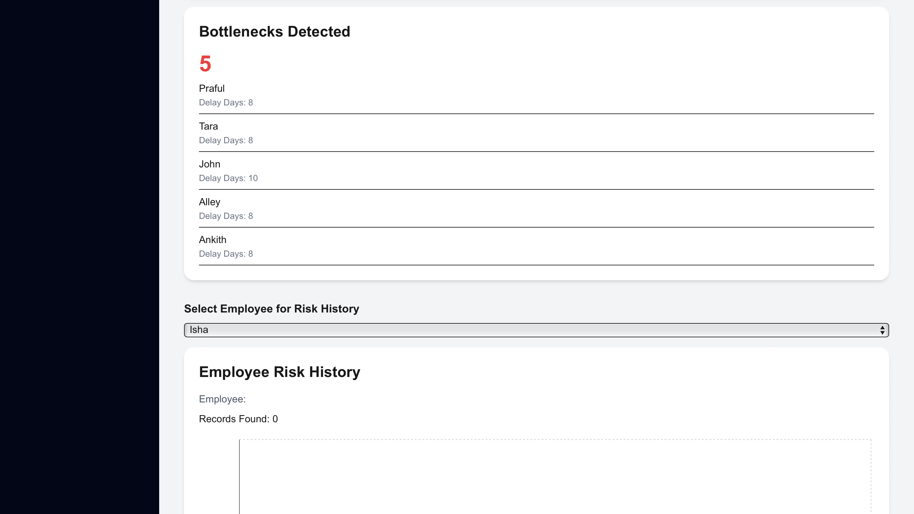


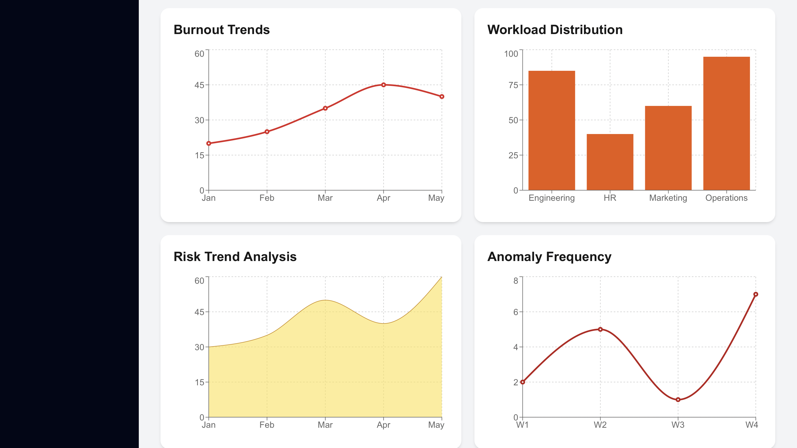

---

### Add Employee

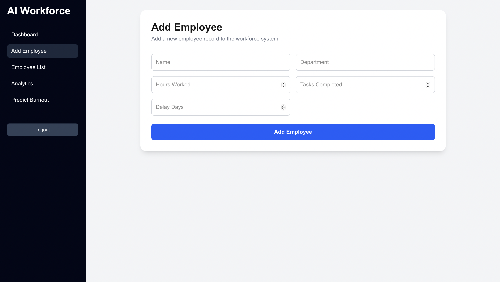

---

### Employee List

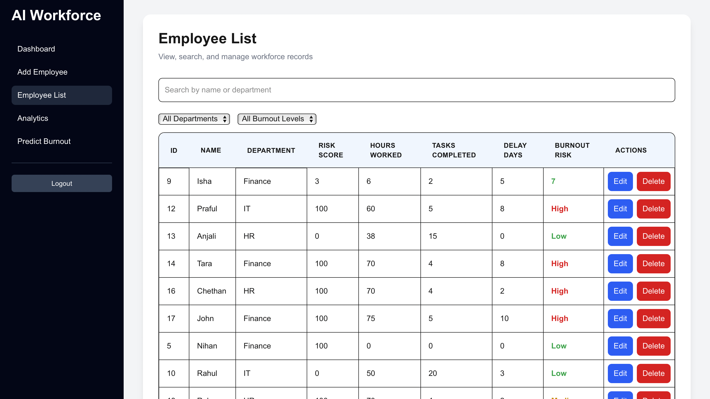

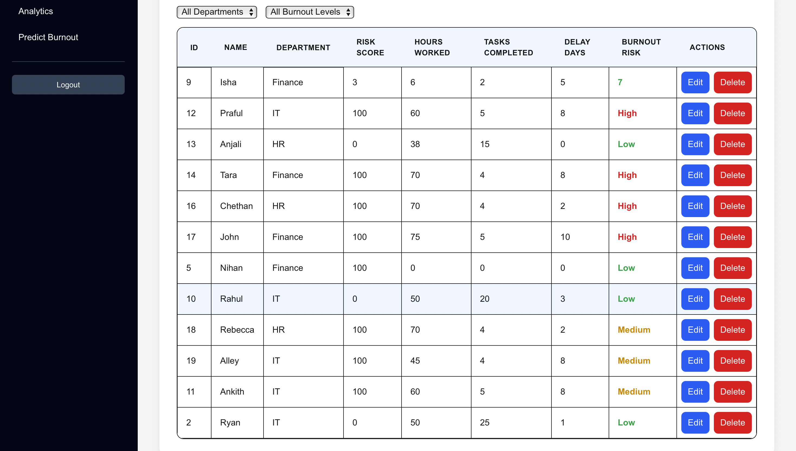

---

### Analytics Dashboard

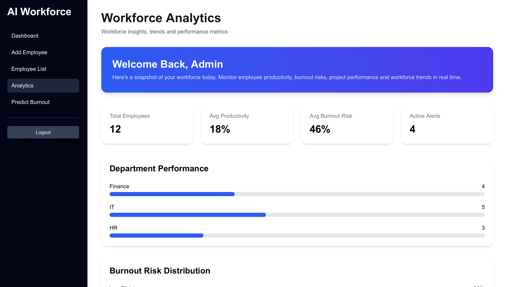

---

### Burnout Prediction Page

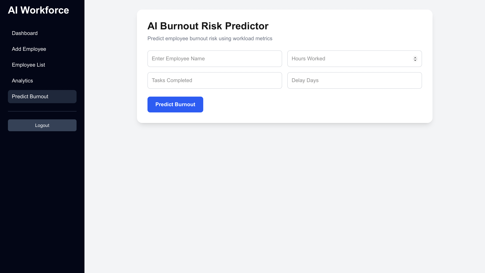

---

### Manager Dashboard

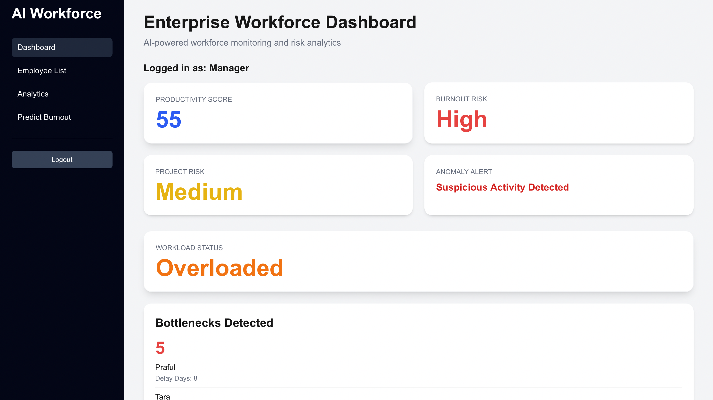

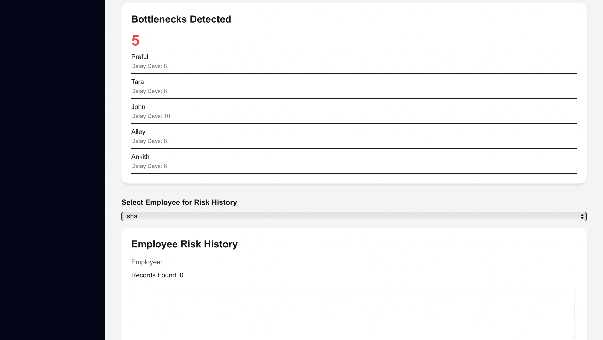

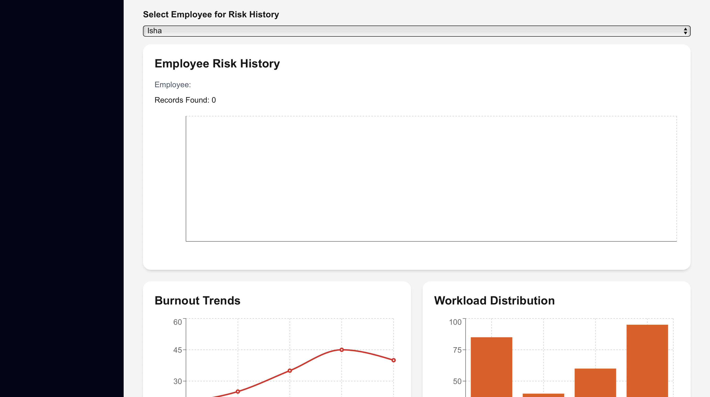


---

### Employee Dashboard

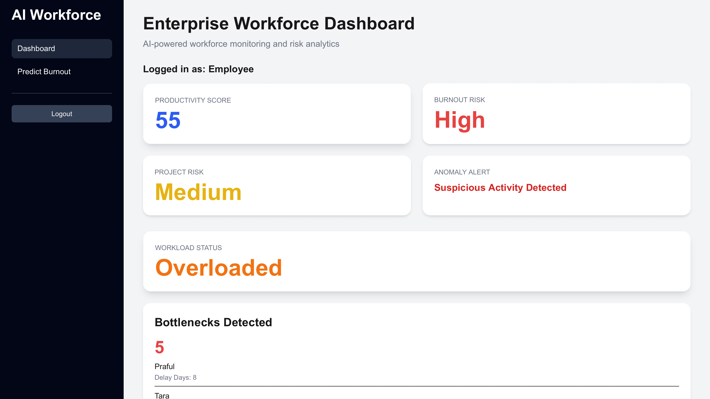

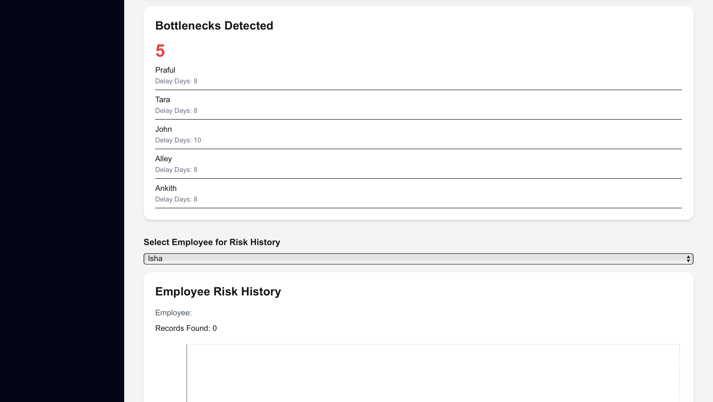

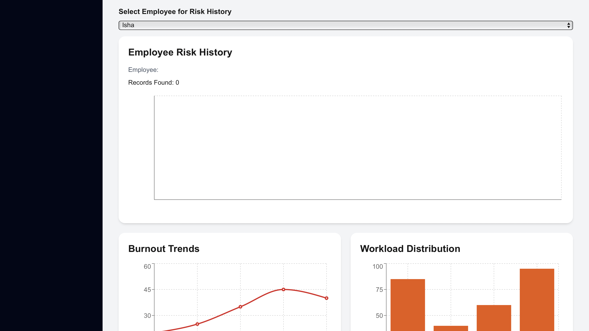

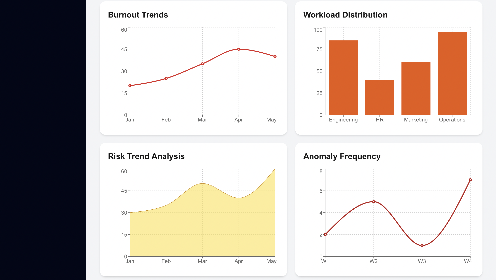


---

## Deployment Links

### Frontend

[https://ai-workforce-risk-system.vercel.app/dashboard]

### Backend API

https://ai-workforce-risk-system.onrender.com

---

## API Endpoints

### Employee Management

* GET /employees
* POST /employees
* PUT /employees/{id}
* DELETE /employees/{id}

### Analytics

* GET /productivity-score
* GET /burnout-risk
* GET /project-risk
* GET /workload-status
* GET /risk-trend
* GET /bottleneck-detection
* GET /employee-history/{id}

### AI Features

* POST /predict-burnout

### Authentication

* POST /login

---

## Future Enhancements

* Real Machine Learning Burnout Models
* Email Notifications
* Employee Recommendation Engine
* Advanced Workforce Forecasting
* Department-Level Analytics
* Export Reports (PDF/Excel)
* Audit Logs
* Multi-Organization Support
* Real-Time Dashboard Updates
* Docker & Kubernetes Deployment

---

## Learning Outcomes

Through this project, I gained hands-on experience with:

* Full-Stack Development
* FastAPI API Development
* Next.js Frontend Development
* PostgreSQL Database Design
* SQLAlchemy ORM
* JWT Authentication
* Role-Based Access Control
* REST API Design
* Data Visualization
* Analytics Dashboard Development
* Cloud Deployment (Render & Vercel)
* Workforce Risk Modeling

